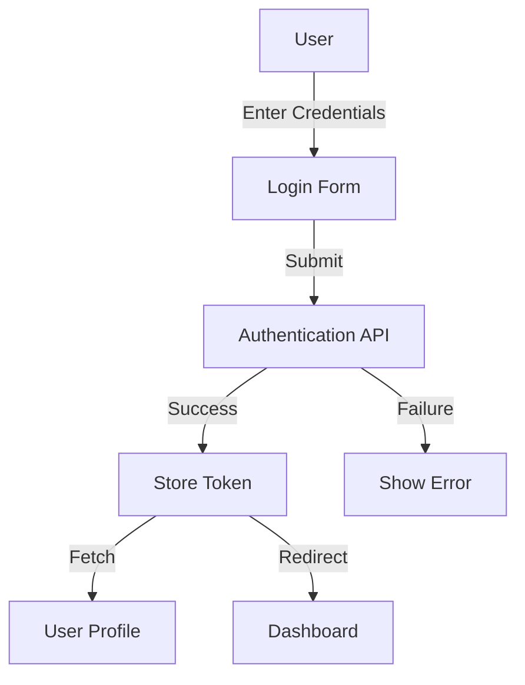

# Technical Documentation

## Architecture Overview

### Frontend Architecture
```
src/
├── components/               # Reusable UI components
│   ├── auth/                # Authentication related components
│   │   ├── PrivateRoute.js
│   │   └── AuthWrapper.js
│   ├── layout/             # Layout components
│   │   ├── Navbar/
│   │   └── LoadingSpinner/
│   └── shared/             # Shared UI components
├── contexts/               # React Context providers
│   ├── AuthContext.js     # Authentication state management
│   └── WorkoutContext.js  # Workout data management
├── pages/                 # Page components
│   ├── public/           # Public access pages
│   └── private/         # Protected pages
├── services/            # API and external services
│   └── api.js          # Axios instance and API methods
└── utils/              # Utility functions and constants
```

### State Management
- Context API for global state
- Local state with useState for component-specific data
- Custom hooks for reusable state logic

### Authentication Flow


### API Integration
```javascript
// Example API configuration
const axiosInstance = axios.create({
  baseURL: process.env.REACT_APP_API_URL,
  headers: {
    'Content-Type': 'application/json',
  },
});

// Auth token interceptor
axiosInstance.interceptors.request.use(
  (config) => {
    const token = localStorage.getItem('token');
    if (token) {
      config.headers.Authorization = `Token ${token}`;
    }
    return config;
  },
  (error) => Promise.reject(error)
);
```

### Performance Optimizations
1. Lazy Loading
```javascript
const Dashboard = React.lazy(() => import('./pages/private/Dashboard'));
```

2. Memoization
```javascript
const MemoizedComponent = React.memo(MyComponent);
```

3. Debounced API Calls
```javascript
const debouncedSearch = useCallback(
  debounce((term) => {
    // API call
  }, 300),
  []
);
```